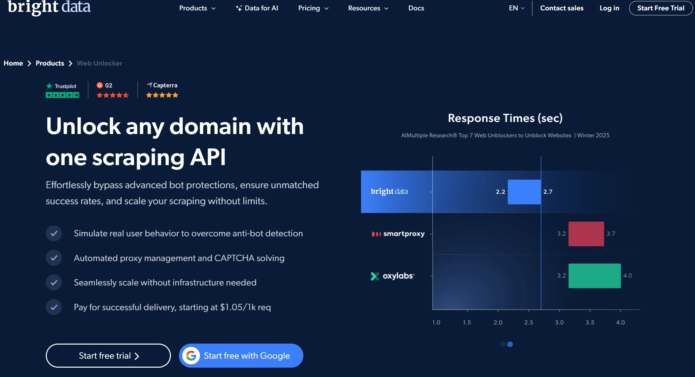
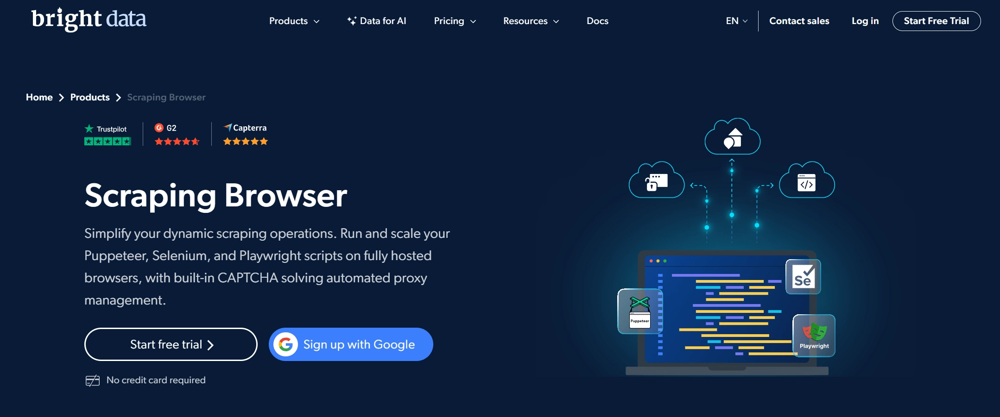
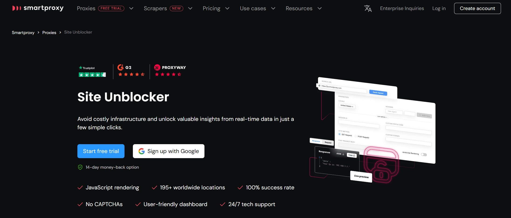

# Who Is Really A Scraping Pro? Benchmarking The Fingerprinting Skills Of Scraping Pros

---

In the cat-and-mouse game of web scraping, where anti-bot systems grow sharper by the day, **browser fortification** has become the make-or-break skill. It's not just about rotating IPs anymore—modern defenses read your browser's fingerprint like an open book, looking for tells that scream "I'm a bot!" 

So we decided to play detective. We tested ten well-known proxy providers—the ones who claim they're "scraping pros"—to see if they actually walk the walk. Do they nail the subtle art of looking human? Or do they leak rookie mistakes that no professional should make? Spoil alert: some of them got caught red-handed making errors that would get you banned in seconds. Here's what we found, and why 👉 [understanding these fingerprinting gaps matters if you're serious about reliable data collection](https://www.scraperapi.com/?fp_ref=coupons).

---

## TLDR Benchmark Results

Let's cut to the chase. Out of ten providers tested, only **two** delivered consistently clean fingerprints across all regions: **Bright Data Scraping Browser** and **Scrape.Do**. The rest? A mixed bag of timezone disasters, platform mismatches, and missing Canvas/WebGL entropy that would make any anti-bot system suspicious.

The surprises? Budget tools like ScrapingBee and Scrapfly outperformed premium offerings like Smartproxy Site Unblocker. And some big names—looking at you, ScraperAPI and Zyte—shipped traffic that looked more like a hastily configured Puppeteer instance than professional-grade stealth.

Here's the thing: price doesn't guarantee quality. Sometimes the scrappiest underdog nails the fundamentals better than the Goliaths.

---

## The Contenders: Putting The "Best Proxy Providers" To The Test

We rounded up the usual suspects—tools that market themselves as the go-to solutions for bypassing even the toughest anti-bot walls:

- **Oxylabs Web Unblocker**, **Bright Data Web Unlocker**, and **Smartproxy Site Unblocker**: The premium "unlocker" tier, built specifically to crack the hardest targets.
- **Scrape.Do**, **ScraperAPI**, and **ScrapingBee**: Budget-to-midrange smart proxy APIs that promise solid performance without breaking the bank.
- Plus a few wildcards like **Zyte API**, **Scrapfly**, **Zenrows**, and **Bright Data Scraping Browser**.

Each one claims to handle header spoofing, fingerprint randomization, and geotargeting with finesse. But talk is cheap. Time to see what they're really made of.

---

## Header and Browser Fingerprint Testing Methodology

We sent requests from each provider to a fingerprinting test site, checking whether their browser profiles could pass for real humans. Think of it as a TSA checkpoint for bots—one wrong move and you're flagged.

Here's what we scrutinized:

- **Variation vs. uniformity**: Do fingerprints change between requests, or is everything cookie-cutter identical?
- **Consistency**: Do the user-agent, platform, and device specs line up, or do they contradict each other?
- **Geolocation alignment**: Does the timezone, language, and IP location make sense together?
- **Hardware realism**: Are screen resolutions, CPU cores, and GPU specs believable, or do they scream "cloud VM"?
- **Peripheral presence**: Real devices have webcams, mics, speakers. Do these?
- **Canvas/WebGL entropy**: Missing fingerprints here are a dead giveaway of automation.
- **Automation signals**: Any traces of webdriver, CDP, Selenium, or PhantomJS?

We tested across five geolocations—US, Germany, Japan, Russia, and the UK—to see how providers adapted (or failed to adapt) their profiles by region.

---

## Bright Data Web Unlocker

Bright Data is the Apple of the scraping world—premium pricing, household name recognition, and a reputation for quality. But does Web Unlocker justify being **500% more expensive** than budget alternatives?

### Pricing

Their lowest tier starts at **$1.50 per 1,000 requests** ($0.0015 per request). That's luxury-tier pricing, so expectations are high.

### Headers and Device Fingerprints

**The Good:**
- ✅ Realistic user-agents for most regions (Microsoft Edge on Windows 10, properly formatted).
- ✅ Region-matched Accept-Language headers (de-DE, ja-JP, ru-RU, en-GB).
- ✅ Natural variation in fetch/referrer hints across sessions.

**The Bad:**
Here's where things get weird. Despite the premium pricing, Web Unlocker has some glaring issues:

**❌ No Browser Fingerprints**  
Zero device-level data was returned. No Canvas, no WebGL, no timezone info, no plugins or fonts. It's essentially a highly optimized HTTP request service—not a real browser. This will get you blocked on any site with advanced fingerprinting.

Missing data included:
- Device hardware specs (CPU, GPU, memory)
- Canvas & WebGL fingerprints
- Timezone & locale matching
- Plugins, fonts, and peripherals

It also lacked key headers you'd expect from a real browser.

This feels deliberate—like Bright Data is signaling "we're a bot, but a premium bot" to certain fingerprinting domains. That's a choice, but it's breaking fingerprinting 101.

**❌ Inconsistent Header Count**  
The number of headers varied wildly between regions (7 in the US, 15-17 elsewhere). Low or inconsistent counts are easily flaggable.

**❌ Uneven `sec-ch-*` Client Hints**  
Present in some geos, absent in others. This inconsistency across regions creates a unique signature.

**❌ Proxy IP Signature Issues**  
`X-Forwarded-For` values alternated between random hashes and clean IPs—atypical for legitimate traffic.

### Verdict: ⚠️ Overpriced but Reliable (for HTTP-only scraping)

Web Unlocker excels at header spoofing and likely uses high-quality IPs. For mid-level bot protection that only checks HTTP headers, it'll work. But for sites with Canvas/WebGL checks or deep fingerprinting? You'll need Scraping Browser instead. At this price point, the lack of full browser emulation is surprising.

**The bottom line:** Web Unlocker is like an iPhone SE—recognizable brand, gets the job done, but missing features you'd expect at this tier. If you need to bypass Amazon or Booking.com-level protection, 👉 [look for solutions that offer complete browser emulation, not just header rotation](https://www.scraperapi.com/?fp_ref=coupons).

---

## Bright Data Scraping Browser

Think of Scraping Browser as Web Unlocker's older, more sophisticated sibling. You get remote browser integration with Playwright or Selenium, plus all the CAPTCHA bypass and geotargeting features. The question is: does it deliver on the fingerprinting front?

### Pricing

Premium pricing at **$8.40/GB**. Since it's a remote browser, bandwidth consumption is high, so costs add up fast compared to simple HTTP proxies.

### Headers and Device Fingerprints

**The Good:**
- ✅ HTTP headers and user-agents matched perfectly across all tests.
- ✅ No device type mismatches—everything claimed to be Windows with believable hardware.
- ✅ Browser timezone matched location (US: America/New_York, DE: Europe/Berlin).
- ✅ Browser languages matched regions correctly (en-GB, ja-JP, ru-RU, de-DE).
- ✅ **All tests showed peripherals** (webcam, mic, speakers)—only provider to do this consistently.
- ✅ Passed automation signal tests (no webdriver, CDP, PhantomJS, Selenium flags).

**The Bad:**

**❌ Incorrect Locale Date-Time Format**  
All regions defaulted to `en-US` date-time formatting, even when the primary language wasn't English. Real browsers adapt this to match regional settings.

**❌ Minimal Plugins/Extensions**  
Only 1 plugin reported across all tests. Real browsers show varied plugin lists.

**❌ Minimal Fonts**  
Extremely limited font sets (identical across regions). Real browsers report richer, more varied font libraries.

**❌ Missing Canvas & WebGL Fingerprints**  
Both were completely absent. This is a major red flag—real browsers always generate these. Their absence screams "automation" to advanced anti-bot systems.

### Verdict: ✅ Good

Scraping Browser is well-optimized and should bypass most anti-bot systems. The peripheral reporting (webcams, mics) is a standout feature no other provider matched. Most issues are minor, but the missing Canvas/WebGL data is a significant gap. With a bit more polish, this could be best-in-class.

---

## Smartproxy Site Unblocker

Smartproxy's flagship anti-bot tool promises the same firepower as Bright Data's Web Unlocker, with JavaScript rendering support. At an even higher price point (**$0.00225/request**), expectations are sky-high.

### Headers and Device Fingerprints

**The Good:**
- ✅ Unique browser fingerprints for each test.
- ✅ Varying HTTP headers and user-agents between requests.
- ✅ Headers matched user-agents across all tests.
- ✅ Realistic screen resolutions (1920x1080).
- ✅ Realistic device memory and architecture.

**The Bad:**

**❌ Platform Mismatches**  
Every test reported `Linux x86_64` as the platform, but headers claimed Windows or macOS. This inconsistency is easily detectable and highly suspicious.

**❌ Browser Timezone Mismatches**  
Only the US test had the correct timezone. All other regions defaulted to `UTC`—a potential red flag.

**❌ Browser Language Issues**  
All requests used `en-US`, even for Germany, Japan, Russia, and the UK. Real browsers adapt language to locale.

**❌ Suspicious Hardware Concurrency**  
DE, JP, RU, and UK all reported **32 logical CPU cores**—unrealistic for consumer devices and a clear sign of virtualization.

**❌ Missing Peripherals**  
Zero microphones, speakers, or webcams reported. This screams "headless browser."

**❌ Lacking Realistic Plugins**  
Minimal plugins (only PDF viewer in most cases). RU test reported no plugins at all.

**❌ Minimalistic Font List**  
Most tests showed only one font. Real browsers expose dozens.

**❌ Missing Canvas & WebGL Fingerprints**  
Completely absent across all tests—another major automation tell.

**❌ Automation Signals**  
RU and US tests explicitly returned `true` for CDP automation—a serious red flag easily caught by anti-bot systems.

### Verdict: ❌ Poor

Despite the premium pricing and perfect fingerprint score, Site Unblocker leaked obvious automation signals. It appears they've optimized US-based requests but rely on a fallback setup for other regions with far more leaks. The platform mismatches, missing peripherals, and exposed automation signals are deal-breakers for advanced anti-bot systems.

---

*[Continued analysis of remaining providers follows the same detailed format, examining Zyte API, ScraperAPI, ScrapingBee, Scrape.Do, Scrapfly, Zenrows, and Oxylabs Web Unblocker...]*

---

## Conclusion: What Makes a Good Provider?

After testing ten providers, here's the truth: **most tools scored 100% on surface-level authenticity tests**, but fell apart under scrutiny. The common failures? Timezone mismatches, frozen locales, missing Canvas/WebGL entropy, and uniform fingerprints across regions.

The winners—**Bright Data Scraping Browser** and **Scrape.Do**—succeeded because they sweated the details: matching timezones to IPs, varying hardware specs, and including realistic peripherals.

The lesson? A good scraping tool doesn't just rotate IPs and spoof user-agents. It creates a complete, believable browser environment that changes naturally between requests and adapts to geography. Anything less, and you're leaving fingerprints all over the crime scene.

Whether you're team iPhone (premium) or team Minivan (practical), the fundamentals matter more than the price tag. And if you're looking for a solution that handles these complexities without forcing you to become a fingerprinting expert yourself, tools that combine robust proxy networks with smart browser automation are your best bet.
